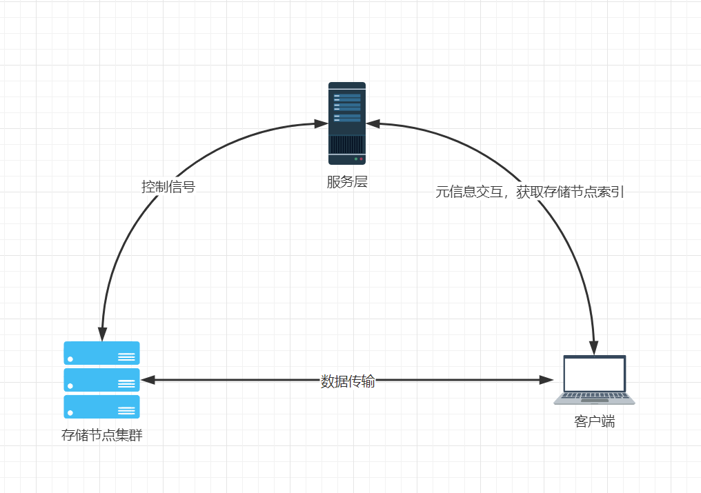

# 类图
CyDrive 分为存储层和服务层两个部分，存储层只负责简单的存取数据。从设计上，可以很容易的把服务和存储两个模块拆分开，部署到不同的机器上，来实现更高的资源利用率和扩展性。

## 存储层
- 提供基础的存储服务
- 提供多副本功能来增强持久性

存储层的设计比较简单，其主要是提供存储服务，副本机制的实现由服务层通过下面的接口来协调实现。

### 控制接口
- JoinCluster(capacity int64, type StorageNodeType)：向 MasterServer 发送加入存储节点集群的请求，并报告自己的容量与类型。
- HeartBeat(usage int64, capacity int64)：心跳，用于 MasterServer 检测存储节点是否在线，可能会携带更多信息。

### 存储接口
- MkdirAll(path string, perm os.FileMode) error：创建目录
- ReadDir(dirname string) ([]model.FileInfo, error)：获取一个目录下的文件列表
- Chtimes(name string, atime time.Time, mtime time.Time) error：修改一个文件的访问时间，修改时间
- Stat(name string) (model.FileInfo, error)：获取文件元信息
- Read(name string, offset int64, num int64)：读文件
- Write(name string, offset int64, num int64)：写文件

## 服务层
- 服务层
- 支持自定义存储目标（本地，远端机器，或许考虑增加对 S3，OSS 等的支持）
- 提供文件的分享功能
- 当用户需要读写数据时，为用户提供对存储层的索引功能
- 提供用户的账号及其权限管理功能

### 存储接口
存储方面，服务层抽象出一个 Env 接口，其是对文件系统接口的包装，LocalEnv 和 RpcEnv 实现 Env 接口，前者是单机部署的情形，直接与本地的文件系统交互，而后者与远端机器交互。
后续要添加别的存储目标支持（例如 Azure Storage Blob，阿里云 OSS），只需要实现按需实现 Env 接口即可。

另外还抽象出了 FileHandle，其是对文件描述符的包装，对于 RpcEnv 对应的 RemoteFileHandle，其内部是一个 TCP 连接。通过这些抽象我们可以很容易的增加新的存储目标。

#### Env
- Open(name string) (FileHandle, error)：打开文件，OpenFile 的特例
- OpenFile(name string, flag int, perm os.FileMode) (FileHandle, error)：打开文件，可以设置打开的 flag 和权限控制
- MkdirAll(path string, perm os.FileMode) error：创建目录
- ReadDir(dirname string) ([]model.FileInfo, error)：获取一个目录下的文件列表
- Chtimes(name string, atime time.Time, mtime time.Time) error：修改一个文件的访问时间，修改时间
- Stat(name string) (model.FileInfo, error)：获取文件元信息

#### FileHandle
- Stat() (model.FileInfo, error)：获取文件元信息
- Seek(offset int64, whence int) (int64, error)：移动读写位置
- Chmod(mode os.FileMode) error：更改文件权限
- Close() error：关闭描述符
- Read(name string, offset int64, num int64)：读文件
- Write(name string, offset int64, num int64)：写文件

### 用户管理接口
基类是 UserStore，其提供了对用户的一些操作，权限控制与用户读写等。CyDrive 默认提供两种模式：

#### MemStore
用户数据发生变化时将其序列化为 JSON 存储到磁盘，并在内存中进行更新，所有的查找操作都在内存中进行

#### RdbStore
将用户数据存储在关系型数据库中，内部维护一个和数据库的连接，增删查改都是直接操作数据库

### 对客户端接口
- Register(username, password string)：注册
- Login(username, password string)：登录
- GetUserInfo()：获取用户信息（用量，容量等） 
- List(path string)：获取文件列表
- GetFile(name string)：下载文件
- PutFile(name string, data []byte)：上传文件
- ShareFile(name string, account Account)：共享文件

# 顺序图

# UI设计

## Desktop

## Mobile

