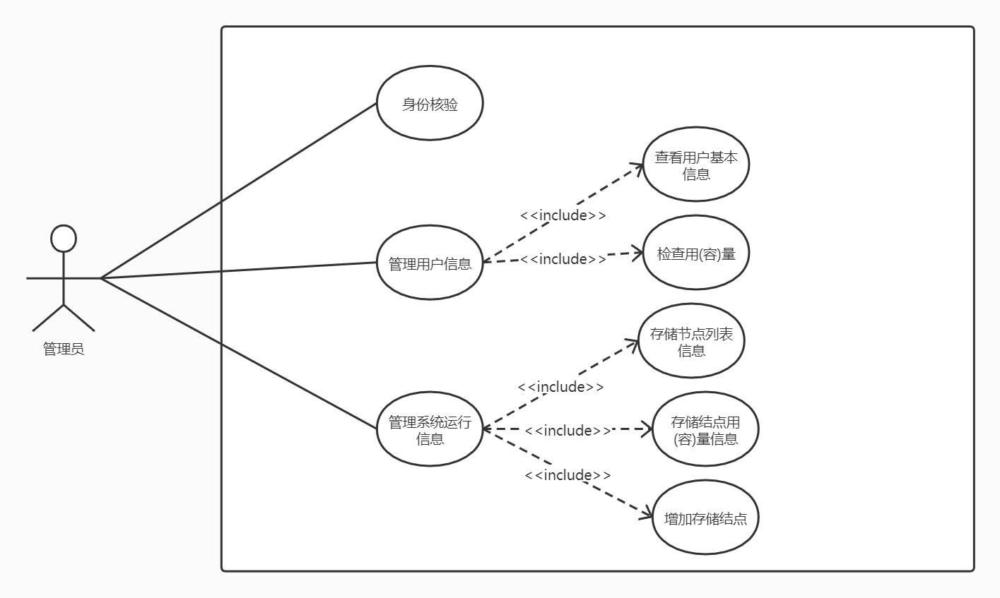

# CyDrive 网盘需求规格说明书

## 修订历史记录
|    日期    | 版本  | 说明  | 作者  |
| :--------: | :---: | :---: | :---: |
| 2021.09.22 | v1.0  | 初版  | 岑洋  |

## 1. 引言

### 1.1 编写目的
本文档编写基于以下准则:

(1) 理解并描述问题的信息域, 并以此建立数据模型.

(2) 定义软件应完成的功能, 并以此建立功能模型.

(3) 描述作为外部事件结果的软件行为, 建立行为模型.

(4) 对描述信息, 功能和行为的模型进行分解, 用层次的方式展示细节.

(5) 利于用户和开发者之间的交流, 为软件开发工作提供了基础和用于测试和验收的依据.

本文档面向多种读者对象:

(1) 项目经理: 了解预期产品的功能, 并据此进行系统设计, 项目管理.

(2) 系统分析员: 对目标系统提出完整, 准确, 清晰, 具体的要求.

(3) 设计员: 对需求进行分析, 并进行系统和功能设计, 包括数据库设计和安全设计.

(4) 程序员: 了解系统功能, 实现并优化软件功能, 编写《用户手册》.

(5) 测试员: 根据本文档编写测试用例及测试文档, 并对软件产品进行功能性测试和非功能性测试.

(6) 用户: 了解预期产品的功能和性能, 并与系统分析员一起对整个需求进行讨论和协商.

### 1.2 项目背景

A. 项目名称: CyDrive

B. 项目提出者: 岑洋，蒋梦旭，孙嘉曦，岳志澄，王玉林，郑彦翀，梁志杰

C. 项目开发者: 岑洋，蒋梦旭，孙嘉曦，岳志澄，王玉林，郑彦翀，梁志杰

D. 项目用户: 需要自建网盘的用户，需要网盘服务的用户

E. 项目开发单位: 武汉大学计算机学院

F. 项目简介:

CyDrive 是一个支持自动同步与共享功能的网盘软件，提供基础的文件上传下载与追加功能。此外还提供自动同步与文件共享功能。其存储分离的设计可以让存储容量可以方便地水平扩展，普通人可以使用 CyDrive 来搭建自己的网盘服务，并将自己的若干废弃设备的存储资源同时利用起来，从而实现废物利用，环境保护。

G. 项目说明:

《CyDrive 网盘需求规格说明书》的目的是明确《CyDrive》中各项功能和非功能需求, 确定系统功能模块, 同时为概要设计和详细设计人员提供设计依据, 也可供本项目的其他开发人员参阅. 本需求分析报告的目的是规范化本软件的编写, 旨在于提高软件开发过程中的能见度, 便于对软件开发过程中的控制与管理, 同时提出了本地铁售票系统的软件开发过程, 便于程序员与客户之间的交流与协作, 并作为工作成果的原始依据, 同时也表明了本软件的共性, 以期能够获得更大范围的应用.

本文档需要交于论证人员进行论证修改, 无误后供软件开发人员进行后期的软件设计.

项目在目前的阶段与其他软件和系统没有关系, 作为一个独立的单位运行.

### 1.3 名称定义和缩写
|  名称  | 缩写  |             定义             |
| :----: | :---: | :--------------------------: |
| 开发者 |  SDE  |   对系统进行维护开发的人员   |
|  用户  | User  |        使用系统的人员        |
| 管理员 | Admin | 使用该系统搭建网盘服务的人员 |

### 1.4 参考文献
[1]. 微软 OneDrive 官网：https://www.microsoft.com/zh-cn/microsoft-365/onedrive/online-cloud-storage

## 2. 系统需求概述

### 2.1 管理员后台系统用例图

### 2.2 客户端用例图

### 2.3 用例的概要描述
### 2.4 假设和依赖

1. 管理员需要具备基础的计算机知识

## 3. 功能需求

### 3.1 服务端系统功能

#### 3.1.1 与客户端交互
- 获取指定文件的索引
- 获取一个目录下的文件列表
- 账号的注册、登录、注销、授权、查询
- 文件的分享（包括临时文件，即不存储在用户网盘中的文件，如临时的图片、消息等）

#### 3.1.2 与管理员交互
- 添加新的存储结点
- 获取系统元信息（如存储用量，容量）
- 获取用户信息（如存储用量，容量）

### 3.2 存储系统功能
- 提供文件的上传下载与追加功能
- 提供多副本支持来增强持久性，对抗系统的不稳定性
- 检测冲突

### 3.3 客户端系统功能
- 从/向 服务端 下载/上传/追加 文件
- 自身账号的注册、登录、注销、查询
- 共享文件给其它用户，或其它设备（可以是网盘中的文件，或自己的本地文件）
- 自动同步（指定一个文件夹，将这个文件夹作为网盘根目录，进行自动同步）
- 检测自身账号的其它设备在线情况，并可以选择向一些设备发送文件
- 提供常见文件的预览（文本，图片等）

## 4. 非功能需求

### 4.1 安全性
| 需求分类 |  定义要素  |                        需求内容                        |
| :------: | :--------: | :----------------------------------------------------: |
| 数据安全 | 数据一致性 | 能够检测到多端同时对同一文件的修改冲突，并指示用户解决 |
| 系统安全 |  访问权限  |   对共享的文件进行权限控制，仅被共享者可以访问该文件   |

### 4.2 易用性
| 需求分类 |  定义要素  |                        需求内容                        |
| :------: | :--------: | :----------------------------------------------------: |
|用户界面| 界面风格要求 | 移动端和桌面端拥有各自的合适的交互逻辑，各移动端统一界面|

### 4.3 可靠性
- 可用性：该系统应当能够24小时*7天的工作
- 传输数据中的网络故障恢复：能够从上次传输的位置继续，而不需要重新传输所有数据

### 4.4 性能

## 5. 运行环境规定
- 主机网络：需要公网 IP
- Golang 版本：1.16 及以上
- 操作系统：Ubuntu 18.04 及以上
- 数据库系统：兼容 MySQL 协议
- Key-Value 存储系统：兼容 Redis 协议

## 6. 验收验证标准

## 7. 团队分工